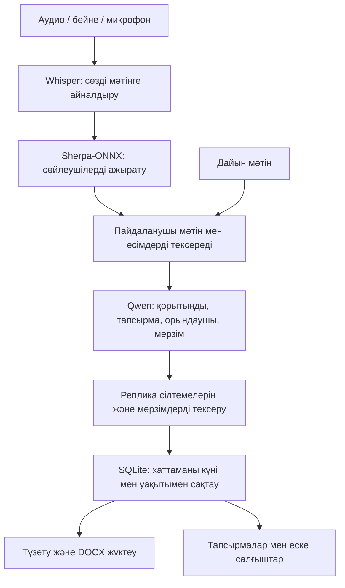

# Khattama AI — «Хаттама»

**HackAlem AI · Hiuaz командасы · Жиналыс хаттамасын тапсырмаларымен бірге дайындайтын жергілікті ЖИ көмекші.**

Жиналыс жазбасын жүктеңіз, танылған мәтін мен сөйлеушілерді тексеріңіз, жауапты адамдары және мерзімдері көрсетілген хаттаманы алыңыз. Дайын хаттама күні мен уақытымен сақталады: оны кейін архивтен таңдап, түзетіп, Word файлы ретінде жүктеуге болады.

[Орнату және қолдану нұсқаулығы](khattama-ai/README.md) · [Тексеру нәтижелері](khattama-ai/VALIDATION.md) · [Дамыту жоспары](#roadmap)

## Қандай мәселені шешеді?

Хатшы жиналысты қолмен жазғанда тапсырманың мазмұны, орындаушысы немесе мерзімі жоғалуы мүмкін. Басшыға кейін кімнің не істеуі керегін қайта анықтауға тура келеді.

«Хаттама» осы жұмысты бір жерде жинайды:

- **Хатшыға:** жазбадан мәтін мен хаттама жобасын дайындау, қате жерлерін түзету, DOCX жүктеу.
- **Басшыға:** тапсырмалардың орындалуын, жақындаған және өткен мерзімдерін көру.
- **Командаға:** бұрынғы жиналысты тауып, тапсырманың қандай сөзге сүйеніп жасалғанын тексеру.

Жобаның ерекшелігі — қазақша/орысша интерфейс, жергілікті модельдер және әр тапсырманы бастапқы репликамен байланыстыру. ЖИ дайындаған нәтиже адам тексергенге дейін хаттама жобасы болып саналады.

## Қазір не бар?

| Мүмкіндік | Қазіргі нұсқа |
|---|---|
| Жазба енгізу | Аудио/бейне файлын жүктеу, браузер микрофоны, дайын мәтін |
| Сөйлеуді тану | Орысша, қазақша және аралас режим; Whisper small |
| Сөйлеушілерді ажырату | Дауыс топтарын бөлу, үзіндіні тыңдап, адамның атын қолмен растау |
| Жиналыс нәтижесі | Қысқаша қорытынды, тапсырма, орындаушы, мерзім, бастапқы репликаға сілтеме |
| Тексеру | Танылған мәтінді, есімдерді, қорытындыны және тапсырмаларды түзету |
| Архив | Автоматты сақтау, сақталған/өзгертілген уақыт, іздеу және DOCX жүктеу |
| Тапсырмаларды бақылау | Жоспарланған / орындалуда / орындалды; кешіккен тапсырмалар сүзгісі |
| Еске салу | Қолданба ішінде мерзімі өткен және алдағы үш күндегі тапсырмалар |
| Интерфейс | Қазақша/орысша; телефон, планшет, компьютер өлшемдеріне бейімделеді |

**Қазіргі шек:** бір файл — 64 МБ-қа және 10 минутқа дейін; бір мезгілде бір ЖИ өңдеуі. Есептеу CPU-да жүреді. Қазақша және аралас аудио сапасы әлі өлшенбеген; жауаптыларды, даталарды және қорытындыны тексеру қажет.

## Тез іске қосу

Тексерілген орта: **MacBook Air 2017 · Intel Core i5 · 8 ГБ RAM · macOS 12.7.6 · Python 3.9.6**. Алғашқы орнатуға интернет және кемінде 5 ГБ бос орын қажет. API кілті, Node.js және Docker қажет емес.

Терминалда командаларды ретімен орындаңыз. Қате шықса, келесі қадамға өтпей, [ақауларды шешу нұсқаулығын](khattama-ai/README.md#troubleshooting) қараңыз.

```bash
git clone https://github.com/BAITC-Hacks/hack-f10f2cb8-hiuaz.git
cd hack-f10f2cb8-hiuaz/khattama-ai
bash install_mac.sh
.venv/bin/python prepare_models.py
.venv/bin/python doctor.py
bash start.sh
```

Браузерде **http://127.0.0.1:8501** ашыңыз. `doctor.py` нәтижесінде барлық кітапхана мен төрт модельге `OK` шығуы керек. Кейін осы `khattama-ai` қалтасынан тек `bash start.sh` орындау жеткілікті. Тоқтату — терминалда **Ctrl+C**.

Модельдер алғаш жүктелгеннен кейін жиналыс жергілікті өңделеді. Linux, басқа порт, диагностика, тесттер және резервтік көшірме командалары [толық нұсқаулықта](khattama-ai/README.md).

## Қалай жұмыс істейді?



1. «Жаңа жиналыс» терезесінде атауын, белгілі болса жиналыс күнін енгізіңіз.
2. Жазбаны таңдаңыз немесе микрофонмен жазыңыз. Қатысушыларға жазба мен ЖИ өңдеуі туралы өзіңіз хабарлап, интерфейсте растаңыз.
3. Алғашқы тексеруге 60 секунд таңдаңыз; танылған сөздер мен сөйлеушілердің есімдерін түзетіңіз.
4. Хаттаманы қалыптастырыңыз. Нәтиже архивке автоматты сақталады.
5. Тапсырмаларды тексеріп, қажет жерін түзетіңіз, «Тексерілді» белгісін қойып, DOCX жүктеңіз.
6. «Тапсырмалар» бетінде орындалу мәртебесін өзгертіңіз.

Жиналыс күні мен файлдың сақталған уақыты бөлек есептеледі. Мысалы, «ертең» деген мерзімді нақты күнге айналдыру үшін жиналыстың күні қажет. Дауыс тобы адамның расталған тұлғасы емес: есімді пайдаланушы белгілейді.

## Технологиялар мен құрылым

| Қабат | Технология / файл |
|---|---|
| Интерфейс | HTML, CSS, JavaScript — [web/](khattama-ai/web/) |
| Жергілікті HTTP API | Python стандартты кітапханасы — [server.py](khattama-ai/server.py) |
| ЖИ тізбегі | PyAV, faster-whisper, Sherpa-ONNX, llama-cpp-python — [core.py](khattama-ai/core.py) |
| Тілдік модель | Qwen2.5-3B-Instruct, GGUF Q4_K_M; CPU |
| Сақтау | SQLite — [protocol_store.py](khattama-ai/protocol_store.py) |
| Экспорт | python-docx; DOCX ішінде қорытынды, тапсырмалар, негіздер және транскрипт |
| Қайта іске қосу | Бекітілген тәуелділіктер, модель ревизиялары, SHA256 тізімі, автоматты тесттер |

Толық файл құрылымы мен модель параметрлері [әзірлеушіге арналған бөлімде](khattama-ai/README.md#architecture).

## HackAlem талаптарына сәйкестігі

| Міндетті талап | Іске асырылуы және тексеру шегі |
|---|---|
| 1. Сөйлеуді мәтінге айналдыру | Нақты орысша жазбаның алғашқы 60 секунды өңделді; дәлдік көрсеткіші өлшенген жоқ |
| 2. Орыс тілін түсіну | Аудио тану және бөлек синтетикалық мәтіннен тапсырма шығару тексерілді |
| 3. Қазақ тілін түсіну | Режим бар; қысқа мәтіннен тапсырма/орындаушы табылды, мерзім мен қорытындыда қате болды; қазақша аудио бағаланбаған |
| 4. Аралас сөйлеуді түсіну | 30 секундтық бөліктерде тіл анықталады; бөліктің ішіндегі тіл ауысуы қате танылуы мүмкін; аудио сапасы бағаланбаған |
| 5. Тапсырма, орындаушы, мерзім | Жергілікті модель, реплика негіздері, даталарды тексеру және қолмен түзету бар |
| 6. Диаризация және адамға байланыстыру | Дауыс топтары бөлінеді; нақты есімді пайдаланушы растайды; диаризация дәлдігі өлшенбеген |
| 7. PDF/DOCX экспорты | DOCX жасалады және қайта ашу тестінен өтті; PDF әзірге жоқ |

Қосымша іске асқан мүмкіндіктер: архив, тапсырма мәртебелері, қолданба ішіндегі еске салғыштар, екі тілдегі бейімделетін интерфейс. Teams/Zoom/Meet-ке қосылатын бот, үздіксіз транскрипция, сыртқы хабарламалар және ЭҚАЖ интеграциясы әзірге жоспарға кіреді.

## Нақты тексерілген нәтижелер

2026 жылғы 23 қыркүйектегі тексерулер, MacBook Air 2017:

- **18 Python тесті өтті**, Chromium браузеріндегі толық интерфейс сценарийі орындалды.
- **320, 390, 768 және 1440 px** ендерінде бет пен форма көлденең тасып шықпады. Нақты iPhone/Android және Safari бөлек тексерілген жоқ.
- Нақты жазбаның **60 секундын тану — 67,45 с**, дауыстарды бөлу — **26,37 с**. Бұл толық хаттама жасау уақыты емес.
- Qwen-нің қысқа орысша мәтін сынағы — **88,99 с**; тапсырма, орындаушы және «ертең» мерзімі дұрыс шықты.
- Қазақша мәтін сынағы — **119,72 с**; тапсырма мен орындаушы табылды, бірақ мерзім түсіп қалып, қорытынды дәл болмады.

Браузер тесттері синтетикалық модель жауабын пайдаланады; олар интерфейс пен сақтауды тексереді. Екі толық жиналыстың барлық кезеңнен өтуі, WER/DER және тапсырма шығару дәлдігі әлі бағаланбаған. Барлық өлшемнің жағдайы мен шектеуі [VALIDATION.md](khattama-ai/VALIDATION.md) ішінде берілген.

## Деректер қайда қалады?

Өңдеу кодында сыртқы ЖИ API шақырулары жоқ; модельдер компьютердегі файлдардан жүктеледі. Архив `khattama-ai/data/protocols.sqlite3` ішінде сақталады. Аудио қолданба тарапынан сервер дискісіне жазылмайды, уақытша жадта өңделеді. Бастапқы файл пайдаланушының өзінде қалады.

Бұл — жергілікті, бір пайдаланушыға арналған прототип. Сервер тек `127.0.0.1` мекенжайын тыңдайды; телефонға бейімделген интерфейс оны басқа құрылғыдан автоматты түрде қолжетімді етпейді. Көп пайдаланушыға қызмет көрсету, HTTPS, кіру құқықтары және база шифрлауы бөлек әзірлеуді қажет етеді. Микрофонға браузер рұқсаты қажет.

Архив, модельдер және жергілікті тексеру файлдары Git-ке қосылмайды. Демонстрация үшін синтетикалық немесе жеке деректері жасырылған жазбаны қолданыңыз. Сақтау тәртібі мен резервтік көшірме [нұсқаулықта](khattama-ai/README.md#storage).

<a id="roadmap"></a>

## Алға қарай қандай өзгерістер енгізуге болады?

Төмендегі тармақтар — келесі нұсқаларға ұсынылған жоспар; қазіргі өнімнің дайын мүмкіндіктері емес.

| Кезең | Өзгеріс | Нәтижені қалай бағалаймыз? |
|---|---|---|
| **1. Сапа** | Қазақша/орысша/аралас аудиодан жеке деректері жасырылған бағалау жиынын жасау; қолмен транскрипт пен тапсырмаларды белгілеу | WER — сөз тану қатесі; DER — сөйлеушіні бөлу қатесі; тапсырма precision/recall, орындаушы мен мерзімнің дәлдігі |
| **1. Сапа** | Қазақшаға лайық модельдерді және лицензиясы сәйкес тілдік модельді салыстыру; қорытынды мен мерзім қателерін азайту | Бірдей тест жиынында қазіргі нұсқамен салыстыру; жіберілген және ойдан қосылған тапсырмаларды санау |
| **2. Ұзақ жиналыс және жылдамдық** | Ұзақ жазбаларды бөліктерге өңдеу, қайталанған тапсырмаларды біріктіру, жабық серверде GPU қолдауын қосу | Толық өңдеу уақыты, ең жоғары жад шығыны, тапсырмалардың бөліктер арасында сақталуы |
| **2. Қолдану ыңғайлылығы** | PDF, құжат үлгілері, толық өзгерістер тарихы, архивті басқару, сақтық көшірмені қалпына келтіру | Word/PDF көрінісі, өзгеріс авторы мен уақыты, деректі жоғалтпай қалпына келтіру сынағы |
| **3. Ұйым ішінде қолдану** | Пайдаланушылар мен рөлдер, HTTPS, қолжетімділік журналы, қауіпсіз телефон қолжетімділігі, орналастыруды автоматтандыру | Әр рөлдің рұқсаты, бір мезгілдегі жұмыс, нақты құрылғылардағы сынақ |
| **3. Интеграциялар** | Teams/Zoom/Meet қосылуы, ЭҚАЖ, күнтізбе, ұйым рұқсат еткен арналарға тапсырма үзіндісі мен еске салғыш жіберу | Қайталап жібермеу, жеткізу мәртебесі, қатысушыларды хабардар ету; аудио/мәтінді сыртқы ЖИ API-ға жібермеу талабын сақтау |

Бірінші басымдық — **қазақша және аралас сөйлеудің сапасын өлшеп, жақсарту**. Одан кейін ұзақ жиналыстар мен ұйым ішіндегі ортақ жұмысты дамыту ұсынылады.

## Қорғауда қалай көрсетуге болады?

1. Мәселені көрсетіңіз: «Кім не істеуі керек және қай күнге дейін?» деген ақпарат бір жерде сақталуы қажет.
2. Қысқа оқу жазбасын өңдеп, сөйлеуші есімін және мәтінді растаңыз. CPU өңдеуіне уақыт бөліңіз; дайын мысал көрсетсеңіз, оны алдын ала өңделген деп белгілеңіз.
3. Тапсырманың бастапқы репликасын ашыңыз, қажет болса мерзімді түзетіңіз.
4. DOCX жүктеңіз, бетті жаңартып, хаттаманың күні/уақытымен архивте қалғанын көрсетіңіз.
5. Тапсырманың мәртебесін өзгертіп, тіл мен экран өлшемін ауыстырыңыз.
6. Өлшенген нәтижелерді, қазіргі қателерді және келесі даму кезеңін түсіндіріңіз.

Қайталауға арналған мәтін мысалы және қадамдар [толық нұсқаулықта](khattama-ai/README.md#demo). Сапаға қатысты қорытындыны тек мәтіндік не интерфейс тестімен шектемеңіз: аудио тізбегін бөлек көрсетіңіз.

## Лицензиялар

Тәуелділіктер мен модель салмақтарының лицензиялары бөлек. Таңдалған Qwen 3B салмақтары **Qwen Research License** арқылы беріледі; лицензия `prepare_models.py` орындалғанда `models/QWEN_LICENSE` файлына жүктеледі. Коммерциялық нұсқа үшін сол шарттарға сәйкес модель таңдау қажет. Құрамдастар туралы [лицензиялар бөлімін](khattama-ai/README.md#licenses) қараңыз. Репозиторийдің өз коды үшін жеке `LICENSE` файлы әзірге қосылмаған.
