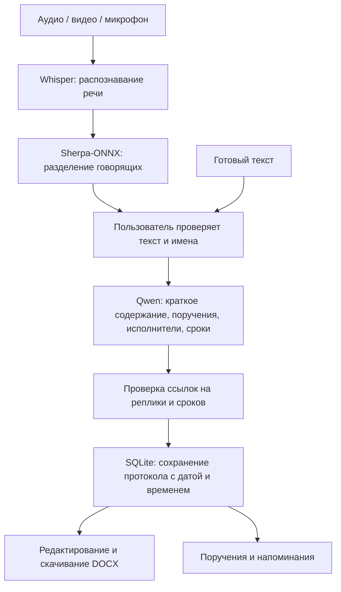

# Khattama AI — «Хаттама»

**HackAlem AI · Команда Hiuaz · Локальный ИИ-помощник для подготовки протоколов совещаний с фиксацией поручений.**

[Қазақша](README.md) · **Русский**

Загрузите запись совещания, проверьте распознанный текст и имена говорящих, получите протокол с поручениями, ответственными и сроками. Готовый протокол сохраняется с датой и временем: его можно выбрать в архиве, отредактировать и скачать в формате Word.

## Содержание

- [Какую проблему решает проект](#purpose)
- [Что уже реализовано](#features)
- [Установка и запуск](#install)
- [Основные команды](#commands)
- [Как пользоваться](#usage)
- [Пример для проверки](#example)
- [Архитектура](#architecture)
- [Соответствие заданию HackAlem](#compliance)
- [Проверки и измеренные результаты](#validation)
- [Хранение данных и резервная копия](#storage)
- [Linux, другие компьютеры и телефон](#platforms)
- [Решение частых проблем](#troubleshooting)
- [План развития](#roadmap)
- [Демонстрация на защите](#presentation)
- [Лицензии](#licenses)

<a id="purpose"></a>

## Какую проблему решает проект?

При ручном ведении протокола могут потеряться или исказиться содержание поручения, имя исполнителя и срок. Руководителю приходится заново выяснять, кто и что должен сделать.

«Хаттама» объединяет эту работу в одном приложении:

- **Для секретаря:** подготовить текст и черновик протокола по записи, исправить ошибки и скачать DOCX.
- **Для руководителя:** увидеть состояние поручений, приближающиеся и просроченные сроки.
- **Для команды:** найти прошлое совещание и проверить, на основании какой реплики сформировано поручение.

Особенности проекта — казахский и русский интерфейс, локальные модели и связь поручений с исходными репликами. Результат ИИ считается черновиком, пока его не проверит человек.

<a id="features"></a>

## Что уже реализовано?

| Возможность | Текущая версия |
|---|---|
| Ввод данных | Загрузка аудио/видео, запись с микрофона браузера, ввод готового текста |
| Распознавание речи | Русский, казахский и смешанный режимы; Whisper small |
| Разделение говорящих | Выделение групп голосов, прослушивание фрагментов, ручное подтверждение имён |
| Результат совещания | Краткое содержание, поручения, ответственные, сроки и ссылки на исходные реплики |
| Проверка и исправление | Редактирование распознанного текста, имён, краткого содержания и поручений |
| Архив | Автоматическое сохранение, время создания и изменения, поиск, скачивание DOCX |
| Контроль поручений | Статусы «запланировано / в работе / выполнено», фильтр просроченных задач |
| Напоминания | Внутри приложения: просроченные задачи и сроки в ближайшие три дня |
| Интерфейс | Казахский и русский; адаптация к размерам телефона, планшета и компьютера |

**Ограничения текущей версии:** файл до 64 МБ и до 10 минут, одна задача моделей одновременно. Вычисления выполняются на CPU. Качество казахского и смешанного аудио ещё не измерено; ответственных, даты и краткое содержание необходимо проверять.

<a id="install"></a>

## Установка и запуск

### Проверенная среда

**MacBook Air 2017 · Intel Core i5-5350U · 8 ГБ RAM · macOS 12.7.6 · Python 3.9.6.**

Для первой установки нужны Git, Python, интернет и не менее 5 ГБ свободного места. В проверенной установке модели занимают около 2,5 ГБ. Для архива и временных загрузок оставьте дополнительное место. API-ключ, Node.js и Docker не требуются.

8 ГБ — объём памяти проверенного компьютера, а не измеренный минимум для любой нагрузки. Пиковое потребление памяти полного сценария пока не определено. Установщик принимает Python 3.9 и новее, но совместимость всех версий Python и macOS не подтверждена.

### 1. Проверить инструменты

Откройте Terminal на Mac:

```bash
python3 --version
git --version
uname -m
sw_vers
```

Для проверенной конфигурации ожидаются Python 3.9.6, архитектура `x86_64` и macOS 12.7.6. Если Git отсутствует, завершите установку Apple Command Line Tools, предложенную системой. Python нужно установить отдельно, если команда `python3` недоступна.

### 2. Скачать проект и установить зависимости

Выполняйте команды по очереди. Если шаг завершился ошибкой, сначала исправьте её.

```bash
git clone https://github.com/BAITC-Hacks/hack-f10f2cb8-hiuaz.git
cd hack-f10f2cb8-hiuaz/khattama-ai
bash install_mac.sh
```

Если репозиторий уже скачан, откройте существующую папку `khattama-ai`. **Все дальнейшие команды, если не указано иное, выполняются из неё.**

Установщик создаёт локальное окружение `.venv`, устанавливает зависимости и проверяет их. Системные пакеты Python не заменяются; `sudo pip` не нужен. Фактически установленные версии записываются в `installed_versions.txt`. На Intel Mac / Python 3.9 используется `requirements-mac.lock`.

До загрузки моделей сообщение `MODEL … не скачана` ожидаемо. Ошибки импорта библиотек с пометкой `ERROR` необходимо устранить.

### 3. Скачать модели

```bash
.venv/bin/python prepare_models.py
```

Модели сохраняются в `models/`: Whisper small, модель сегментации речи, TitaNet Small для голосов и Qwen2.5-3B-Instruct Q4_K_M. Этот шаг использует интернет и не открывает файлы совещаний. После скачивания обработка выполняется локально.

Скрипт записывает контрольные суммы SHA256 в `models/manifest.json`. Создание списка сумм само по себе не является автоматической сверкой с эталоном или проверкой целостности при каждом запуске.

### 4. Проверить установку и открыть приложение

```bash
.venv/bin/python doctor.py
.venv/bin/python -m pip check
bash start.sh
```

В `doctor.py` должны быть `OK` для всех семи библиотек и `MODEL … OK` для всех четырёх моделей. Проверяйте именно строки результата: отсутствие модели может не приводить к ненулевому коду завершения диагностики. Ожидаемый результат `pip check` — `No broken requirements found.`

Откройте **http://127.0.0.1:8501** в браузере. На Mac можно выполнить во втором терминале:

```bash
open http://127.0.0.1:8501
```

Терминал с сервером должен оставаться открытым. Для остановки нажмите **Ctrl+C**. При следующих запусках достаточно выполнить `bash start.sh` из папки `khattama-ai`; повторно устанавливать зависимости и скачивать модели не нужно.

<a id="commands"></a>

## Основные команды

| Действие | Команда |
|---|---|
| Запустить приложение | `bash start.sh` |
| Проверить библиотеки и наличие моделей | `.venv/bin/python doctor.py` |
| Проверить зависимости | `.venv/bin/python -m pip check` |
| Скачать все модели | `.venv/bin/python prepare_models.py` |
| Запустить на другом порту | `.venv/bin/python server.py --port 8502` |
| Проверить работающий сервер | `curl http://127.0.0.1:8501/api/health` |
| Выполнить Python-тесты | `.venv/bin/python -m unittest discover -s tests -v` |

Если выбран порт 8502, измените его также в адресе браузера и команде `curl`. При наличии всех файлов моделей ответ проверки сервера:

```json
{"ok": true, "models_ready": true}
```

Это проверка доступности сервера и наличия файлов, а не качества работы ИИ. Отдельно активировать виртуальное окружение не требуется: команды явно используют `.venv/bin/python`.

Для загрузки отдельных компонентов:

```bash
.venv/bin/python prepare_models.py --only asr
.venv/bin/python prepare_models.py --only diarization
.venv/bin/python prepare_models.py --only llm
```

Если загрузка прервалась, повторите соответствующую команду. Уже скачанные файлы используются повторно.

<a id="usage"></a>

## Как пользоваться?

### Из записи в протокол

1. Выберите **ҚАЗ** или **РУС** в верхней части страницы. Язык интерфейса задаёт язык инструкции для нового краткого содержания и поручений, а также заголовков DOCX. Ранее сохранённые протоколы при переключении языка автоматически не переводятся.
2. Нажмите **«Новое совещание» / «Загрузить запись»**. Укажите название, дату встречи, если она известна, и при желании список участников. Неизвестную дату оставьте пустой.
3. Во вкладке **«Аудио / видео»** выберите файл: MP3, WAV, M4A, MP4, OGG, FLAC или WEBM. Внутри должна быть читаемая аудиодорожка. Лимит — **64 МБ и 10 минут**.
4. Можно записать звук с микрофона. Предварительно сообщите участникам о записи и обработке с помощью ИИ, подтвердите это в форме и дайте браузеру доступ к микрофону. После остановки запись можно отправить на обработку. Это не потоковая транскрипция.
5. Выберите **язык записи**: русский, казахский или смешанный. Это отдельная настройка, независимая от языка интерфейса.
6. Для первой проверки выберите **«Первые 60 секунд»**. Даже в этом режиме исходный файл должен быть не длиннее 10 минут: более длинную запись сначала разделите.
7. Оставьте автоматическое определение количества говорящих или укажите известное число. Подтвердите уведомление участников и начните обработку. Само приложение уведомления участникам не отправляет.
8. Прослушайте обработанный фрагмент и образцы голосов. Укажите имена и исправьте реплики. Метка `SPEAKER_…` обозначает группу голоса, а не подтверждённую личность.
9. Сформируйте протокол. Модель предложит краткое содержание, поручения, исполнителей и сроки; результат автоматически попадёт в архив.
10. Проверьте результат. Откройте исходные реплики поручений, исправьте ошибки через редактирование, поставьте отметку проверки и скачайте **DOCX**.

Дата совещания и время сохранения протокола учитываются отдельно. Например, для преобразования «завтра» в календарную дату нужна дата встречи. При неизвестном сроке требуется уточнение, а не подстановка произвольной даты.

ИИ может перепутать автора поручения и исполнителя, смысл действия или срок. Наличие ссылки на реплику не гарантирует правильную интерпретацию её содержания.

Во время обработки можно закрыть диалог и пользоваться архивом: сервер продолжит работу. После обновления страницы идентификатор текущей задачи восстанавливается в той же вкладке. Остановка сервера прерывает незавершённую обработку; автоматически она не возобновляется. Сохранённые протоколы остаются в базе.

### Из готового текста

Выберите вкладку **«Текст»** и введите реплики по одной на строку в формате `Имя: текст`. Проверьте их и сформируйте протокол. Этот режим пропускает распознавание и диаризацию, но использует локальную Qwen для поручений и краткого содержания.

### Разделы приложения

| Страница | Назначение |
|---|---|
| **Обзор** | Счётчики сохранённых протоколов и поручений, последние встречи, задачи, требующие внимания |
| **Протоколы** | Поиск по названию, фильтры проверки, дата и время сохранения, выбор и скачивание документа |
| **Страница протокола** | Краткое содержание, исходные реплики, основания поручений, редактирование, DOCX |
| **Поручения** | Поиск по тексту, исполнителю или встрече; изменение статуса; фильтр просроченных задач |

Напоминания показываются для незавершённых поручений с прошедшим сроком или сроком от сегодня до трёх дней вперёд. На открытой странице обзора или списков они обновляются раз в минуту, когда нет открытого диалога и активной обработки. Email, сообщения в мессенджеры и системные push-уведомления не отправляются. Неизвестный срок не считается просроченным.

<a id="example"></a>

## Пример для проверки

Для короткой текстовой проверки выберите **РУС**, создайте «Учебное совещание» с датой **2026-09-23** и введите:

```text
Олег: Мария, отправь готовый отчет завтра.
Мария: Хорошо, отправлю завтра.
```

В зафиксированном прогоне получилось одно поручение — отправить готовый отчёт; исполнитель — Мария; исходный срок — «завтра»; дата — **2026-09-24**. Новый результат тоже сравните с исходником.

Отметьте протокол как проверенный, скачайте DOCX, обновите страницу и снова откройте документ из архива. Затем измените статус поручения на «выполнено» и проверьте счётчики. Имена и ситуация в этом примере вымышлены.

Смешанный учебный текст находится в [examples/mixed_meeting.txt](khattama-ai/examples/mixed_meeting.txt). Его качество с последней инструкцией модели повторно не оценивалось. Текстовая проверка не заменяет обработку отдельной учебной аудиозаписи.

<a id="architecture"></a>

## Как устроен проект?



| Часть | Реализация |
|---|---|
| Интерфейс | HTML, CSS, JavaScript — [web/](khattama-ai/web/); без CDN и сборки Node.js |
| Локальный HTTP API | Стандартная библиотека Python — [server.py](khattama-ai/server.py); фоновые задачи |
| Обработка | [core.py](khattama-ai/core.py): PyAV → Whisper → Sherpa-ONNX → Qwen → проверка результата → DOCX |
| Архив | SQLite и транзакционная запись — [protocol_store.py](khattama-ai/protocol_store.py) |
| Модели | [prepare_models.py](khattama-ai/prepare_models.py): загрузка, фиксированные ревизии, список SHA256 |
| Диагностика и запуск | [doctor.py](khattama-ai/doctor.py), [install_mac.sh](khattama-ai/install_mac.sh), [start.sh](khattama-ai/start.sh) |
| Проверки | [tests/](khattama-ai/tests/), [VALIDATION.md](khattama-ai/VALIDATION.md) |
| Прежний интерфейс | [app.py](khattama-ai/app.py): Streamlit, сохранён для совместимости и регрессионных тестов |

PyAV декодирует звук в моно, 16 кГц. Whisper small работает на CPU в INT8 с двумя потоками и временными метками слов. В смешанном режиме язык определяется по 30-секундным окнам; переключения языка внутри окна могут теряться.

Sherpa-ONNX использует pyannote segmentation 3.0 и NeMo TitaNet Small. Реплики связываются с голосами по времени, после чего пользователь подтверждает имена. Пересекающаяся речь может определяться ошибочно.

Qwen2.5-3B-Instruct GGUF Q4_K_M работает через llama-cpp-python: контекст `8192`, входной лимит около `4600` токенов, ответ до `3072` токенов, `n_gpu_layers=0`, `offload_kqv=False`. При превышении лимита нужно разделить текст. Даже текст десятиминутной записи может не поместиться. Незавершённый JSON не выдаётся за готовый результат.

Исходная формулировка срока (`deadline_raw`) и календарная дата (`due_date`) сохраняются отдельно. Для некоторых случаев с единственным поручением и единственной репликой правило постобработки может восстановить явно сказанный относительный срок, пропущенный моделью. Такой срок помечается для проверки; это отдельное правило, а не показатель точности модели.

В DOCX включаются краткое содержание, поручения, основания и транскрипт. Пустой архив не заполняется демонстрационными данными: показатели рассчитываются по реальным сохранённым записям. Основная команда `start.sh` запускает `server.py`.

<a id="compliance"></a>

## Соответствие требованиям HackAlem

| Обязательное требование | Реализация и границы проверки |
|---|---|
| 1. Распознавание речи | Обработаны первые 60 секунд реальной записи на русском языке; точность распознавания не измерялась |
| 2. Понимание русского языка | Проверены распознавание аудио и отдельно извлечение поручения из синтетического текста |
| 3. Понимание казахского языка | Режим реализован; из короткого текста извлечены поручение и исполнитель, но были ошибки в сроке и резюме; казахская аудиозапись не оценивалась |
| 4. Понимание смешанной речи | Язык определяется для фрагментов по 30 секунд; переключение языка внутри фрагмента может распознаваться неверно; качество на аудио не оценивалось |
| 5. Поручение, исполнитель, срок | Реализованы локальная модель, ссылки на исходные реплики, проверка дат и ручное редактирование |
| 6. Диаризация и связь с участником | Голоса разделяются на группы; имя участника подтверждает пользователь; точность диаризации не измерялась |
| 7. Экспорт в PDF/DOCX | DOCX создаётся и прошёл тест повторного открытия; экспорта в PDF пока нет |

Дополнительно реализованы архив, статусы поручений, напоминания внутри приложения и адаптивный интерфейс на двух языках. Бот для Teams/Zoom/Meet, непрерывная транскрипция, внешние уведомления и интеграция с СЭД пока входят в план развития.

<a id="validation"></a>

## Проверки и измеренные результаты

Результаты на MacBook Air 2017, зафиксированные **23 сентября 2026 года**:

- **18 Python-тестов прошли за 9,317 с**, полный браузерный сценарий Chromium выполнен без ошибок JavaScript.
- При ширине **320, 390, 768 и 1440 px** страница и форма не выходили за ширину экрана. Физические iPhone/Android и Safari отдельно не проверялись.
- Распознавание **60 секунд реальной записи — 67,45 с**, разделение голосов — **26,37 с**. Это не полное время создания протокола. Полученные четыре акустических кластера не означают четыре подтверждённых участника.
- Короткий русский текстовый тест Qwen — **88,99 с**; поручение, исполнитель и срок «завтра» определены корректно.
- Казахский текстовый тест — **119,72 с**; поручение и исполнитель найдены, но срок пропущен, краткое содержание неточное.

Браузерные тесты используют синтетический ответ модели и искусственное устройство микрофона, проверяя интерфейс и сохранение. HTTP, формы, SQLite и DOCX в них настоящие. Эти проверки не измеряют точность ИИ.

Оба полных совещания через всю цепочку ещё не проверены. WER — доля ошибок распознавания слов, DER — ошибка разделения говорящих, точность извлечения поручений, качество казахского/смешанного аудио и пиковое потребление памяти полного сценария не измерены. DOCX проверен повторным открытием средствами Python; визуальная проверка длинного документа в Word/Pages остаётся отдельной задачей.

Условия измерений и подробные ограничения: [VALIDATION.md](khattama-ai/VALIDATION.md).

### Повторить Python-проверки

Из папки `khattama-ai`:

```bash
.venv/bin/python doctor.py
.venv/bin/python -m pip check
.venv/bin/python -m unittest discover -s tests -v
```

### Проверить интерфейс в браузере

Это дополнительная проверка для разработчика, не обязательная для обычного запуска. Создайте отдельное окружение:

```bash
python3 -m venv /tmp/khattama-browser
/tmp/khattama-browser/bin/python -m pip install playwright==1.48.0
/tmp/khattama-browser/bin/python -m playwright install chromium
/tmp/khattama-browser/bin/python tests/browser_check.py
```

Установка Playwright и браузера требует интернета. Скрипт запускает тестовый сервер на свободном порту с отдельной временной базой. Пользовательский архив не заполняется тестовыми протоколами. Скриншоты и тестовый DOCX сохраняются в `.local-validation/ui/`.

Проверяется путь: текст → проверка реплики → протокол → скачивание → редактирование → обновление страницы → поиск исполнителя → статус → язык → аудио/микрофон → подтверждение голоса → сохранение.

Для оценки качества моделей нужны отдельные русские, казахские и смешанные записи с ручной разметкой. [evaluation/meeting_reference_checks.json](khattama-ai/evaluation/meeting_reference_checks.json) используется для сравнения и не подставляется в ответы модели.

<a id="storage"></a>

## Где хранятся данные?

Готовые протоколы автоматически записываются в `khattama-ai/data/protocols.sqlite3`: название, дата встречи, транскрипт, краткое содержание, поручения и DOCX. Время создания и последнего изменения фиксируется отдельно в часовом поясе Алматы. Редактирование не меняет первоначальное время сохранения и не подменяет дату совещания.

Протоколы сохраняются после перезапуска сервера. Документы с одинаковыми названиями имеют разные идентификаторы. При одновременном редактировании из двух окон устаревшая версия отклоняется, чтобы не перезаписать новое изменение без предупреждения.

В коде обработки нет вызовов внешних ИИ API; модели открываются из локальных файлов. Внешние шрифты и аналитика не используются. `start.sh` включает офлайн-режим библиотек. Отдельный запуск с полностью заблокированным внешним трафиком ещё не проводился.

Приложение не записывает загруженное аудио на серверный диск. Микрофонная запись сначала находится в памяти браузера, затем передаётся локальному серверу. Сервер хранит в памяти до четырёх последних работ, включая временное аудио. Работы старше часа удаляются **при следующем запуске обработки**, а не гарантированно в момент истечения часа. При остановке сервера временная память освобождается. Исходный файл пользователя остаётся на прежнем месте.

Это локальный однопользовательский прототип: аккаунтов, ролей, HTTPS и шифрования базы средствами приложения нет. Доступ к базе определяется правами файловой системы. Сервер слушает только `127.0.0.1`, проверяет Host/Origin и специальный заголовок изменяющих запросов; это не заменяет многопользовательскую систему доступа.

Архив, модели и локальные результаты проверок исключены из Git. Перед публикацией новых файлов проверяйте `git status`: правила игнорирования не заменяют проверку личных данных. Для демонстрации используйте синтетические или обезличенные записи.

### Резервная копия

Сначала остановите сервер через Ctrl+C. После создания базы выполните из `khattama-ai`:

```bash
mkdir -p "$HOME/Documents/Khattama-backups"
cp -n data/protocols.sqlite3 "$HOME/Documents/Khattama-backups/protocols-$(date +%Y%m%d-%H%M%S).sqlite3"
```

Команда создаёт отдельную копию с отметкой времени. Если `Documents` синхронизируется с облаком, выберите другое локальное место согласно требованиям организации. При восстановлении сервер должен быть остановлен; сначала сохраните копию текущей базы. Кнопки восстановления в интерфейсе пока нет. Аудио в резервную копию базы не входит.

<a id="platforms"></a>

## Linux, другие компьютеры и телефон

Несмотря на название, `install_mac.sh` содержит отдельную ветку Linux: устанавливает `requirements.txt` и собирает llama-cpp-python для CPU из исходников. Нужны Python 3.9+, `venv`, gcc/g++ и инструменты сборки.

Пример подготовки системных зависимостей на Ubuntu/Debian:

```bash
sudo apt update
sudo apt install git python3 python3-venv python3-dev build-essential cmake
```

Далее выполните скачивание репозитория, `bash install_mac.sh`, загрузку моделей, диагностику и запуск из [раздела установки](#install). Прежняя цепочка обработки проверялась на Linux x86_64 / Python 3.12; полная установка нового веб-интерфейса на Linux отдельно не подтверждена. Windows, WSL и Apple Silicon также требуют отдельной проверки.

Перенос на компьютер с GPU или сервер NVIDIA/Brev сам по себе не включает CUDA: текущая конфигурация использует CPU. Поддержка GPU в закрытом контуре входит в план развития.

**Доступ с телефона:** адаптивная вёрстка поддерживает небольшой экран, но сервер доступен только на своём компьютере через `127.0.0.1`. Этот адрес на телефоне не указывает на Mac. Для доступа с другого устройства нужны изменения сетевых настроек сервера, HTTPS и аутентификация; готовой команды для такого режима в текущем проекте нет. Микрофону требуется разрешение браузера и безопасный контекст — localhost или HTTPS.

<a id="troubleshooting"></a>

## Решение частых проблем

| Проблема | Действие |
|---|---|
| Не найден `start.sh` или `.venv/bin/python` | Откройте папку `khattama-ai`; если окружение не создано, выполните `bash install_mac.sh` |
| Модель не готова / `MODEL … не скачана` | Выполните `prepare_models.py` либо соответствующий `--only`, затем снова `doctor.py` |
| `No matching distribution found` | Сверьте Python и архитектуру: специальный Mac-набор проверен для Intel / Python 3.9; другой среде может понадобиться отдельный подбор зависимостей |
| `_OBJC_CLASS_$_MLComputePlan` | На macOS 12 Intel / Python 3.9 используйте `bash install_mac.sh`: Mac lock-файл закрепляет Sherpa-ONNX 1.10.46; версия 1.12.40 на этом Mac не импортировалась |
| `Address already in use` | Остановите предыдущий сервер через Ctrl+C либо запустите `.venv/bin/python server.py --port 8502` и откройте соответствующий адрес |
| Браузер не подключается | Проверьте терминал сервера и адрес, выполните `curl http://127.0.0.1:8501/api/health` |
| Микрофон не включается | Проверьте отметку уведомления участников, разрешения браузера/системы и адрес localhost; можно загрузить готовый файл |
| Обработка занимает много времени | Начните с 60 секунд, закройте тяжёлые приложения; одновременно выполняется одна модельная задача |
| Длинная запись отклоняется даже в режиме 60 секунд | Сам исходный файл должен быть не длиннее 10 минут; разделите его заранее |
| Текст или ответ не помещается | Разделите реплики на смысловые части и обработайте отдельно; автоматического объединения пока нет |
| Ошибки в словах или голосах | Проверьте язык записи и количество говорящих; исправьте реплики и имена, особенно при пересечении голосов |
| Неверный исполнитель, срок или краткое содержание | Сравните с исходной репликой, укажите правильную дату встречи при создании, исправьте готовое поручение в редакторе |
| Протокол изменён в другом окне | Обновите страницу и редактируйте последнюю версию |
| Истекло время временных данных обработки | Загрузите запись заново; уже сохранённый протокол остаётся в архиве |
| Старый вид интерфейса после обновления | Перезапустите сервер и обновите страницу на Mac через **⌘⇧R** |

На проверенном Mac были предупреждения о пропущенных ядрах Metal и повторном классе `CoreMLExecution`, при этом CPU-прогон завершился. Если обработка остановилась, проверьте конкретную ошибку в терминале: не любое сообщение является безвредным предупреждением.

<a id="roadmap"></a>

## Какие изменения можно внести в дальнейшем?

Ниже приведён предлагаемый план следующих версий. Эти возможности пока не реализованы в текущем продукте.

| Этап | Изменение | Как оценивать результат? |
|---|---|---|
| **1. Качество** | Подготовить обезличенный набор аудиозаписей на казахском, русском и смешанном языке; вручную разметить транскрипты и поручения | WER — доля ошибок распознавания слов; DER — ошибка диаризации; precision/recall для поручений, точность определения исполнителя и срока |
| **1. Качество** | Сравнить модели, подходящие для казахского языка, и языковые модели с подходящей лицензией; сократить ошибки в резюме и сроках | Сравнение с текущей версией на одном наборе данных; подсчёт пропущенных и выдуманных поручений |
| **2. Длительные совещания и скорость** | Обрабатывать длинные записи по частям, объединять повторяющиеся поручения, добавить поддержку GPU на закрытом сервере | Полное время обработки, пиковое потребление памяти, сохранение поручений на границах фрагментов |
| **2. Удобство использования** | Добавить PDF, шаблоны документов, полную историю изменений, управление архивом и восстановление из резервной копии | Проверка вида документов в Word/PDF, фиксации автора и времени изменения, восстановления без потери данных |
| **3. Работа внутри организации** | Добавить пользователей и роли, HTTPS, журнал доступа, безопасный доступ с телефона и автоматизацию установки на сервере | Проверка прав каждой роли, одновременной работы и работы на реальных устройствах |
| **3. Интеграции** | Подключить Teams/Zoom/Meet, СЭД, календарь, отправку выдержек с поручениями и напоминаний в разрешённые организацией каналы | Отсутствие повторных отправок, статус доставки, информирование участников; соблюдение запрета на передачу аудио и текста во внешние облачные ИИ API |

Первый приоритет — **измерить и улучшить качество обработки казахской и смешанной речи**. Затем предлагается развивать поддержку длительных совещаний и совместной работы внутри организации.

<a id="presentation"></a>

## Как показать проект на защите?

1. Объясните проблему: информация о том, кто, что и к какому сроку должен сделать, должна храниться в одном месте.
2. Обработайте короткую учебную запись, подтвердите имена участников и текст. Заложите время на обработку на CPU; если показываете готовый пример, обозначьте, что он обработан заранее.
3. Откройте исходную реплику, на которой основано поручение, и при необходимости исправьте срок.
4. Скачайте DOCX, обновите страницу и покажите, что протокол сохранился в архиве с датой и временем.
5. Измените статус поручения, переключите язык и размер экрана.
6. Объясните измеренные результаты, текущие ошибки и следующий этап развития.

Для повторения доступны [пример текста](#example) и [результаты проверок](#validation). Не делайте выводов о качестве всей системы только по текстовым или интерфейсным тестам: отдельно покажите обработку аудио.

<a id="licenses"></a>

## Лицензии компонентов

Лицензия библиотеки и лицензия весов модели могут различаться. Основные компоненты:

- [faster-whisper](https://github.com/SYSTRAN/faster-whisper) и [Whisper small](https://huggingface.co/Systran/faster-whisper-small).
- [Sherpa-ONNX](https://github.com/k2-fsa/sherpa-onnx), [pyannote segmentation](https://huggingface.co/pyannote/segmentation-3.0) и [NeMo TitaNet Small](https://catalog.ngc.nvidia.com/orgs/nvidia/teams/nemo/models/titanet_small). Лицензия сегментации скачивается вместе с моделью.
- [llama-cpp-python](https://github.com/abetlen/llama-cpp-python) и [Qwen2.5-3B-Instruct-GGUF](https://huggingface.co/Qwen/Qwen2.5-3B-Instruct-GGUF). Выбранные веса Qwen 3B распространяются по **Qwen Research License** для исследования и оценки. Текст скачивается в `models/QWEN_LICENSE`. Для коммерческого использования нужна конфигурация с моделями, лицензии которых допускают такое использование.

Для собственного кода репозитория отдельный файл `LICENSE` пока не добавлен. Лицензии компонентов не являются общей лицензией на весь проект. Оригинальные пользовательские аудиозаписи и личные транскрипты не публикуются.
